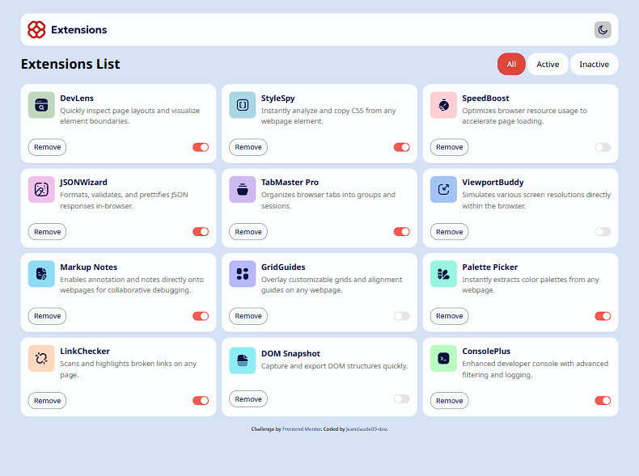

# Frontend Mentor - Browser extensions manager UI solution

This is a solution to the [Browser extensions manager UI challenge on Frontend Mentor](https://www.frontendmentor.io/challenges/browser-extension-manager-ui-yNZnOfsMAp). Frontend Mentor challenges help you improve your coding skills by building realistic projects. 

## Table of contents

- [Overview](#overview)
  - [The challenge](#the-challenge)
  - [Project tree](#project-tree)
  - [Screenshot](#screenshot)
  - [Links](#links)
  - [Built with](#built-with)
  - [What I learned](#what-i-learned)
  - [Continued development](#continued-development)
- [Author](#author)
- [Acknowledgments](#acknowledgments)

**Note: Delete this note and update the table of contents based on what sections you keep.**

## Overview

### The challenge

Users should be able to:

- Toggle extensions between active and inactive states
- Filter active and inactive extensions
- Remove extensions from the list
- Select their color theme
- View the optimal layout for the interface depending on their device's screen size
- See hover and focus states for all interactive elements on the page

### Project tree

```
browser-extensions-manager-ui-main
├─ components.json
├─ eslint.config.js
├─ index.html
├─ jsconfig.json
├─ package-lock.json
├─ package.json
├─ preview.jpg
├─ public
│  ├─ images
│  │  ├─ favicon-32x32.png
│  │  ├─ logo-console-plus.svg
│  │  ├─ logo-devlens.svg
│  │  ├─ logo-dom-snapshot.svg
│  │  ├─ logo-grid-guides.svg
│  │  ├─ logo-json-wizard.svg
│  │  ├─ logo-link-checker.svg
│  │  ├─ logo-markup-notes.svg
│  │  ├─ logo-palette-picker.svg
│  │  ├─ logo-speed-boost.svg
│  │  ├─ logo-style-spy.svg
│  │  ├─ logo-tab-master-pro.svg
│  │  └─ logo-viewport-buddy.svg
│  └─ vite.svg
├─ README-template.md
├─ README.md
├─ src
│  ├─ App.jsx
│  ├─ assets
│  │  ├─ design
│  │  │  ├─ desktop-design-dark-active.jpg
│  │  │  ├─ desktop-design-dark-focus.jpg
│  │  │  ├─ desktop-design-dark-hover.jpg
│  │  │  ├─ desktop-design-dark-inactive.jpg
│  │  │  ├─ desktop-design-dark.jpg
│  │  │  ├─ desktop-design-light-active.jpg
│  │  │  ├─ desktop-design-light-focus.jpg
│  │  │  ├─ desktop-design-light-hover.jpg
│  │  │  ├─ desktop-design-light-inactive.jpg
│  │  │  ├─ desktop-design-light.jpg
│  │  │  ├─ mobile-design-dark.jpg
│  │  │  └─ mobile-design-light.jpg
│  │  ├─ fonts
│  │  │  ├─ NotoSans-Italic-VariableFont_wdth,wght.ttf
│  │  │  ├─ NotoSans-VariableFont_wdth,wght.ttf
│  │  │  └─ static
│  │  │     ├─ NotoSans-Bold.ttf
│  │  │     ├─ NotoSans-Medium.ttf
│  │  │     └─ NotoSans-Regular.ttf
│  │  ├─ images
│  │  │  ├─ icon-moon.svg
│  │  │  ├─ icon-sun.svg
│  │  │  └─ logo.svg
│  │  └─ react.svg
│  ├─ components
│  │  ├─ extensions.jsx
│  │  ├─ header.jsx
│  │  ├─ themeToggle.jsx
│  │  └─ ui
│  │     └─ switch.jsx
│  ├─ context
│  │  ├─ appContext.jsx
│  │  └─ themeContext.jsx
│  ├─ data
│  │  └─ data.json
│  ├─ index.css
│  ├─ lib
│  │  └─ utils.js
│  └─ main.jsx
├─ style-guide.md
├─ tailwind.config.js
└─ vite.config.js

```

### Screenshot



### Links

- Solution URL: [Add solution URL here](https://your-solution-url.com)
- Live Site URL: [browser-extensions-manager-ui](https://browser-extensions-manager-ui-mauve.vercel.app/)


### Built with

- Semantic HTML5 markup
- Tailwindcss v4
- Flexbox
- CSS Grid
- Desktop-first workflow
- [React](https://reactjs.org/) - JS library
- [Shadcn](https://ui.shadcn.com/)
- [Lucide](https://lucide.dev/) - Icons library

### What I learned


- JavaScript `filter()` array method
```js
const filteredData = data.filter((item) => {
    if (filter === "active") return item.isActive;
    if (filter === "inactive") return !item.isActive;
    return true;
  });
```

- `useContext`, `createContext()`  and custom hook
```js
export const AppContext = createContext();

export const ContextProvider = ({ children }) => {
  const [data, setData] = useState(itemData);

  return (
    <AppContext.Provider value={{ data, setData }}>
      {children}
    </AppContext.Provider>
  );
};

export const useApp = () => {
  return useContext(AppContext);
};
```


### Continued development

- `UseEffect()` 
- Context Provider
- JavaScript array methods

## Author

- Frontend Mentor - [@jeanclaude09-dev](https://www.frontendmentor.io/profile/jeanclaude09-dev)
- Twitter - [@iamjeanclaude09](https://www.twitter.com/iamjeanclaude09)
- Github - [@jeanclaude09-dev](https://github.com/Jeanclaude09-dev)


## Acknowledgments

Many thanks to [parfaitBashombe](https://github.com/parfaitBashombe) 
He helped me a lot in this challenge and I learned a lot
